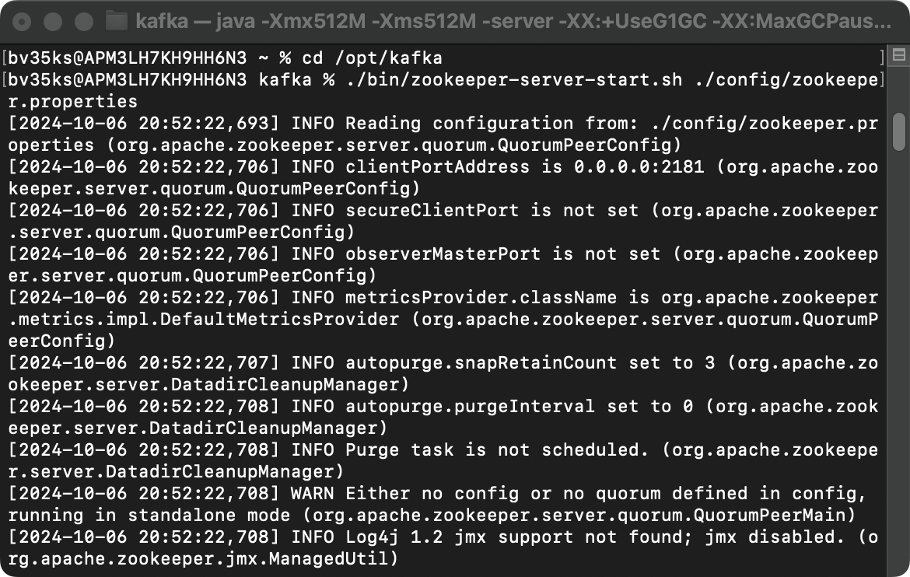
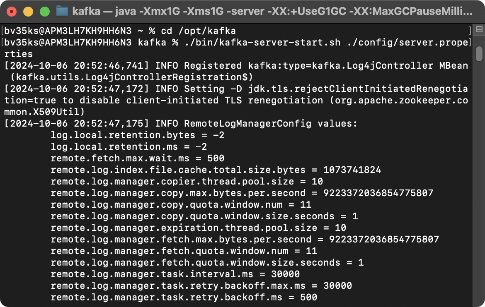
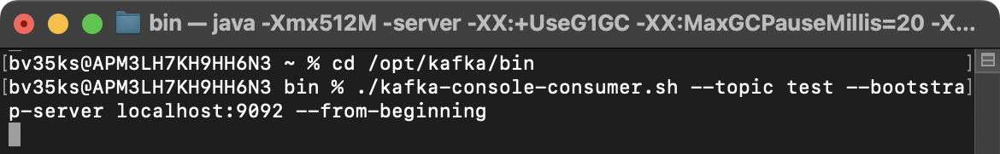
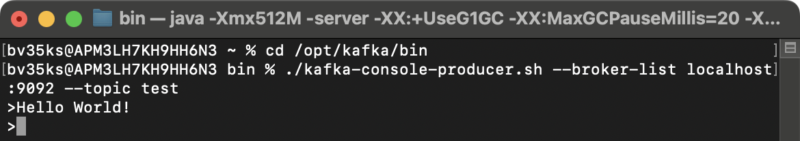

<h1 align="center">Kafka Tutorial - Mac</h1> 

Go to https://kafka.apache.org/downloads

 

+ Binary downloads
+ Download source code `Scala 2.13  - kafka_2.13-3.8.0.tgz (asc, sha512)`

 

+ Double-click on the `.tgz` file to extract folder

 

+ Under Privileges, drag and drop `kafka_2.13-3.8.0` folder to `opt` directory

 

+ Rename to `kafka` folder

 

> ~ % **cd /opt/kafka/config**

 

> config % **open server.properties**

 

#### Uncomment `listeners` and put `localhost` next to port (if will use only on local Desktop)

 

> config % **open zookeeper.properties**

 

> ~ % **cd /opt/kafka/bin**

#### Start Zookeeper and Kafka server

> ./zookeeper-server-start.sh /opt/kafka/config/zookeeper.properties

 

> ./kafka-server-start.sh /opt/kafka/config/server.properties

 

#### Create Topic

> ./kafka-topics.sh --create --bootstrap-server localhost:9092 --topic test

 

#### Consumer

> ./kafka-console-consumer.sh --topic test --bootstrap-server localhost:9092 --from-beginning

 

#### Producer

> ./kafka-console-producer.sh --broker-list localhost:9092 --topic test

Input `Hello World!` message in the `producer` function and press Enter.

 

Check the `Hello World!` message in the `consumer` function

 

#### Delete Topic
> ./kafka-topics.sh —delete --bootstrap-server localhost:9092 --topic test

#### Stop Kafka and Zookeeper server
> ./kafka-server-stop.sh 
> ./zookeeper-server-stop.sh

 

Delete the `kafka-logs` and `zookeeper-data` folders from `opt/kafka` directory

 