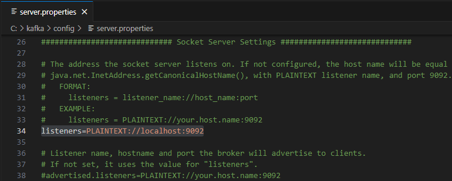

<h1 align="center">Kafka Tutorial - Windows</h1> 

Go to https://kafka.apache.org/downloads

 

+ Binary downloads
+ Download source code `Scala 2.13  - kafka_2.13-3.8.0.tgz (asc, sha512)`

 

+ Extract `kafka_2.13-3.8.0.tgz`

 

+ Copy and paste `kafka_2.13-3.8.0` folder to Drive `C:`

 

+ Rename `kafka_2.13-3.8.0` folder to `kafka`

 

In the `C:\kafka\config` directory, you will find all the configuration of the **server** and **zookeper** with the extension of `.properties` in its' file name

 

In `server.properties`, provide the path where **kafka** folder is extracted in `log.dirs`

 

Put in `c:/kafka/kafka-logs` as the `log.dirs` path

 

Uncomment `listeners` and put `localhost` next to port (if will use only on local Desktop)

 

 

In `zookeeper.properties`, provide the path for the data directory in `dataDir`

 

Put in `c:/kafka/zookeeper-data` as the `dataDir` path 
Zookeeper is also required to enable to run the kafka server, will act as a resource manager for the server

 

Go to `C:\kafka` directory, **Ctrl + L** to highlight the URL bar

 

And enter `cmd` in the field, press Enter to open the `Command Prompt` located to the `C:\kafka` directory

 

Run the **Zookeeper** server and provide its' configuration using the following code :
> .\bin\windows\zookeeper-server-start.bat .\config\zookeeper.properties

 

Zookeeper has started. **Do not close** the window while running the zookeeper

 

Run the **Kafka** server and provide its' configuration using the following code :
> .\bin\windows\kafka-server-start.bat .\config\server.properties

 

Kafka has started. **Do not close** the window while running the kafka

 

Executable files are in Shell script found in `C:\kafka\bin` directory 
Windows batch files can be found in `C:\kafka\bin\windows` directory

 

Go to `C:\kafka\bin\windows` directory, **Ctrl + L** to highlight the URL bar 
And enter `cmd` in the fields, press Enter to open the `Command Prompt` located to the `C:\kafka\bin\windows` directory

 

`Topic` is a table in a relational database 
But in topic, the data can be a flexible schema but stores data in a **json format**

`Bootstrap` server provide the **localhost** name and **port** number by which communicate with the kafka cluster. 
Kafka uses port `9092` by default.

Create a `test` topic on the kafka server using the following command :
> kafka-topics.bat --create --bootstrap-server localhost:9092 --topic test

 

Run the `producer` function using the following command :
> kafka-console-producer.bat --broker-list localhost:9092 --topic test

 

Run the `consumer` function using the following command :
> kafka-console-consumer.bat --topic test --bootstrap-server localhost:9092 --from-beginning

 

Input `Hello World!` message in the `producer` function and press Enter.

 

Check the `Hello World!` message in the `consumer` function 

 

Delete the `test` topic

> kafka-topics.bat --delete --bootstrap-server localhost:9092 --topic test

 

Stop **Kafka** and **Zookeeper** server

> .\bin\windows\kafka-server-stop.bat .\config\server.properties  
> .\bin\windows\zookeeper-server-stop.bat .\config\zookeeper.properties

 

Delete the `kafka-logs` and `zookeeper-data` folders from `C:\kafka` directory

 